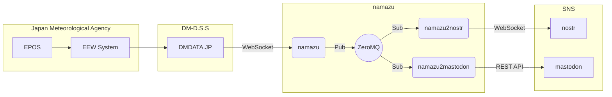

# namazu

[DMDATA.JP](https://dmdata.jp)経由で緊急地震速報（予報）を受け取ってSNSに投げるプログラム一式

## Flow

## 投稿先

* mastodon
    * [@namazu@fedi.matsuu.org](https://fedi.matsuu.org/@namazu)
* nostr
    * [npub1namazu7um9xvgfpax6yrk9tl3segxpgac67jx7cuttzqp7usem9sqavlhz](https://iris.to/npub1namazu7um9xvgfpax6yrk9tl3segxpgac67jx7cuttzqp7usem9sqavlhz)

## References

* [緊急地震速報（地震動予報） | DMDATA.JP](https://dmdata.jp/docs/telegrams/ew09040)
* [気象庁防災情報XMLフォーマット　情報提供ページ](https://xml.kishou.go.jp/)
